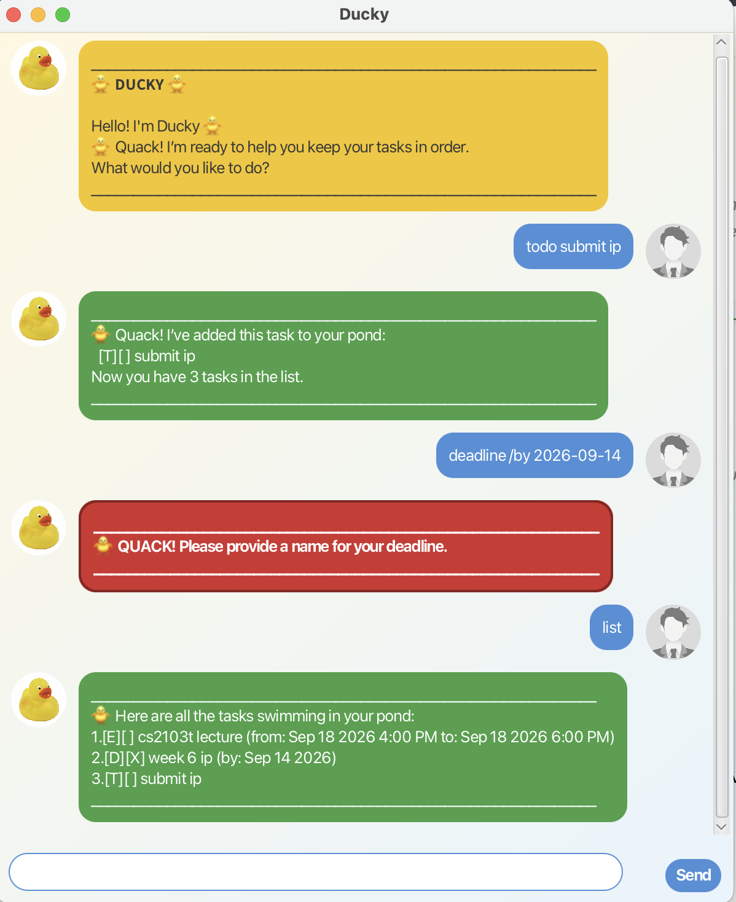

# Ducky

Ducky is a cheerful desktop task manager operated using typed commands. It helps you record to-dos, deadlines,
and events, organize them with tags, and keep track of their completion status. Your tasks are saved automatically
between sessions.



## Quick start

1. Install Java 25 or later.
   Mac users must install the Java version prescribed in the
   [Java 25 Installation Guide for Mac Users](https://se-education.org/guides/tutorials/javaInstallationMac.html).
2. Download `ducky.jar` and place it in a folder of your choice.
3. Open a terminal in that folder and run:

   ```shell
   java -jar ducky.jar
   ```

4. Type a command into the input box and press **Enter** or click **Send**.
5. Try `todo read a book`, followed by `list`.

To run Ducky from its source code instead, open the project in IntelliJ IDEA with JDK 25 and run `ducky.Launcher`,
or execute `./gradlew run` from the project folder.

## Command format

Words in `UPPER_CASE` represent values that you must provide. Items in square brackets are optional. Task numbers
refer to the numbers shown by the `list` command and must be positive integers.

Dates use `yyyy-MM-dd`, while event date-times use `yyyy-MM-dd HHmm` in 24-hour time. For example,
`2026-09-20 1430` means 20 September 2026 at 2:30 PM.

## Features

### Adding a to-do: `todo`

Adds a task without a date or time.

Format: `todo DESCRIPTION [#TAG]...`

Example: `todo read a book #leisure`

### Adding a deadline: `deadline`

Adds a task that must be completed by a specific date.

Format: `deadline DESCRIPTION /by DATE [#TAG]...`

Example: `deadline submit report /by 2026-09-20 #school`

Only one `/by` marker is allowed, and the date must exist on the calendar.

### Adding an event: `event`

Adds a task with a start and end date-time.

Format: `event DESCRIPTION /from START /to END [#TAG]...`

Example: `event project meeting /from 2026-09-20 0900 /to 2026-09-20 1030 #school`

The end must be later than the start. Only one `/from` and one `/to` marker are allowed.

### Tagging tasks

Add hashtags to to-dos, deadlines, or events to organize them. Tags are case-insensitive, displayed in lowercase,
and stored only once per task.

Examples:

* `todo watch a movie #Fun #weekend`
* `deadline submit report /by 2026-09-20 #school`
* `event team meeting /from 2026-09-20 0900 /to 2026-09-20 1000 #work`

A tag must begin with a letter or number and may also contain hyphens or underscores.

### Listing tasks: `list`

Displays every task with its current number and completion status.

Format: `list`

`[ ]` indicates an incomplete task and `[X]` indicates a completed task.

### Finding tasks: `find`

Finds tasks whose descriptions or tags contain the given keyword. Searches are case-insensitive.

Format: `find KEYWORD`

Examples:

* `find report`
* `find #school`

### Marking a task as complete: `mark`

Marks the task at the specified number as completed.

Format: `mark TASK_NUMBER`

Example: `mark 2`

Tip: Run `list` first to check the current task numbers.

### Marking a task as incomplete: `unmark`

Changes a completed task back to incomplete.

Format: `unmark TASK_NUMBER`

Example: `unmark 2`

### Deleting a task: `delete`

Permanently removes the task at the specified number.

Format: `delete TASK_NUMBER`

Example: `delete 2`

### Exiting Ducky: `bye`

Closes the application after showing Ducky's farewell message.

Format: `bye`

### Automatic saving

Ducky saves changes after every add, mark, unmark, and delete command. Saved tasks are loaded automatically the
next time Ducky starts. No manual save command is needed.

The data file is located at `data/duke.txt`, relative to the folder from which Ducky is launched. Avoid editing
this file manually because invalid content may prevent the saved tasks from loading.

### Understanding message colors

Ducky uses different chat bubble colors so you can quickly distinguish each type of message:

* Blue for commands entered by the user
* Yellow for Ducky's welcome message
* Green for successful commands
* Red for invalid commands and other errors

The window can be resized, and messages wrap to fit the available width.

## FAQ

**Q: How do I transfer my tasks to another computer?**

A: Copy `data/duke.txt` to the same relative location beside the Ducky application on the other computer.

**Q: What should I do if Ducky reports that it cannot load or save tasks?**

A: Check that the application folder and `data` folder are readable and writable. If the data file was edited
manually, restore a valid backup or move the invalid file elsewhere before restarting Ducky.

## AI acknowledgement

I used AI tools (ChatGPT Codex) in this project to assist with selected parts of the coding process. My use of AI
for coding was limited to completing and polishing code that I had first written by hand. I also used AI to
brainstorm ideas and help resolve debugging issues. I reviewed and adapted all AI-assisted work to ensure that it
met the project's requirements and that I understood the resulting implementation.

## Command summary

| Action | Command | Example |
| --- | --- | --- |
| Add a to-do | `todo DESCRIPTION [#TAG]...` | `todo read a book #leisure` |
| Add a deadline | `deadline DESCRIPTION /by DATE [#TAG]...` | `deadline submit report /by 2026-09-20 #school` |
| Add an event | `event DESCRIPTION /from START /to END [#TAG]...` | `event meeting /from 2026-09-20 0900 /to 2026-09-20 1000` |
| List tasks | `list` | `list` |
| Find tasks | `find KEYWORD` | `find #school` |
| Complete a task | `mark TASK_NUMBER` | `mark 2` |
| Reopen a task | `unmark TASK_NUMBER` | `unmark 2` |
| Delete a task | `delete TASK_NUMBER` | `delete 2` |
| Exit | `bye` | `bye` |
